# Design Patterns

## UML Diagrams

### Types

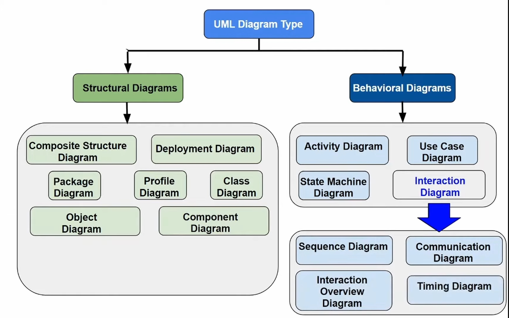

### Class diagram

- Represented as rectangle with 3 sections
  - Class name
  - Class attributes
  - Class methods
- Only class name is **mandatory**
- Access Modifiers
  - +: public
  - -: private
  - #: protected
  - ~: package local
- Parameter Directionality (wrt caller)

  - in: not changed by the method
  - out: serves as output value for the method
  - inout: provided by caller and used as the output value for the method

  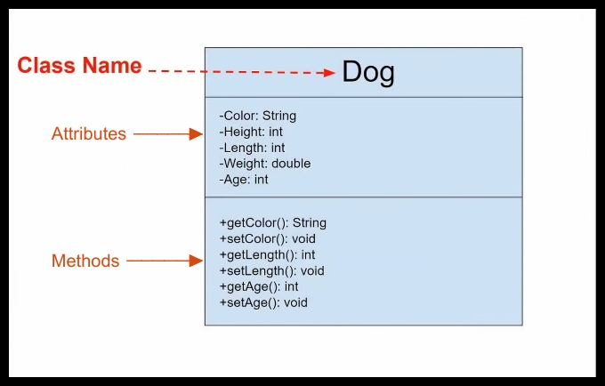

- Levels of specifications of class diagrams
  - Conceptual perspective
    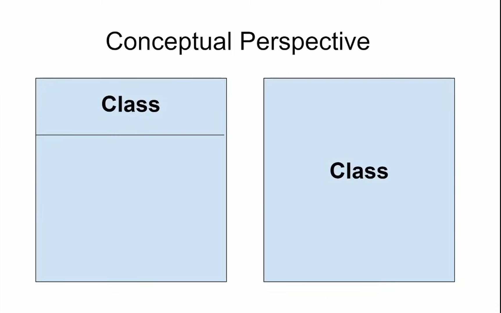
  - Specification perspective
    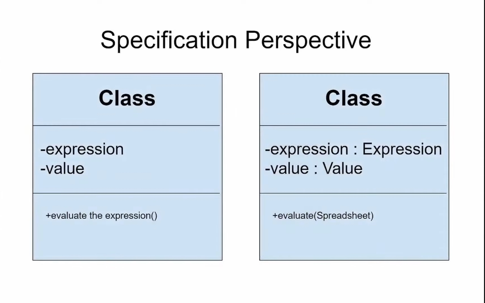
  - Implementation perspective
    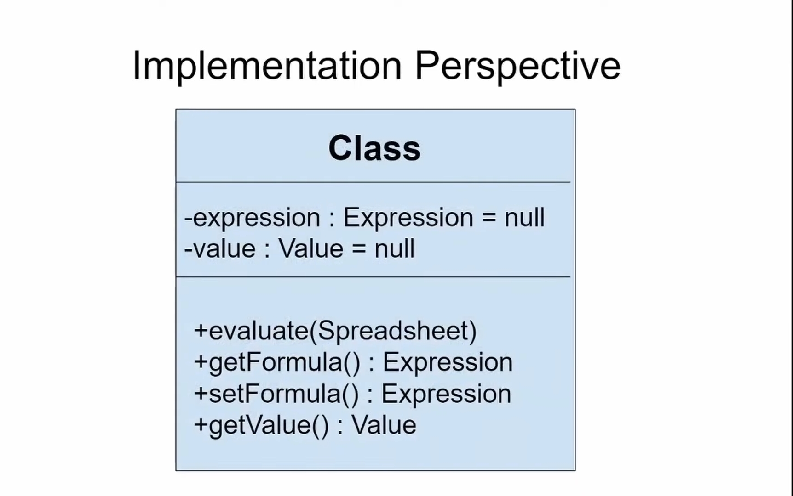
- Relationships between classes
  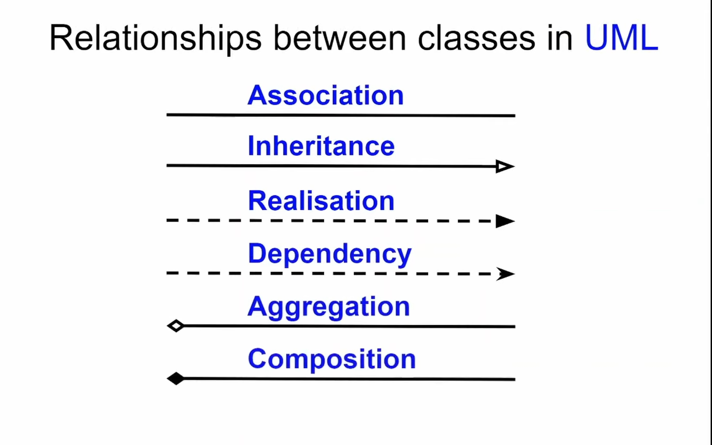

  - Association
    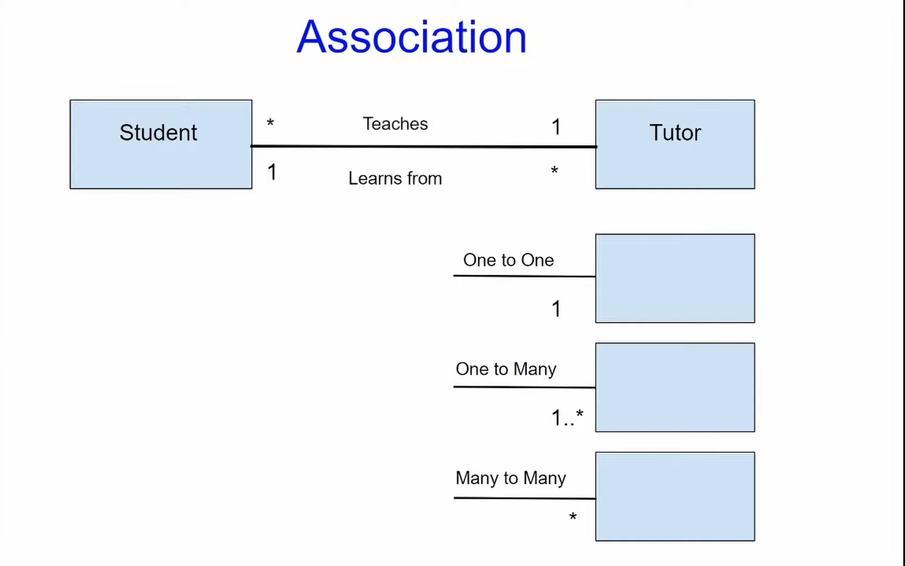
  - Inheritance (Generalization)

    - Name of **abstract class** in written in _italics_

    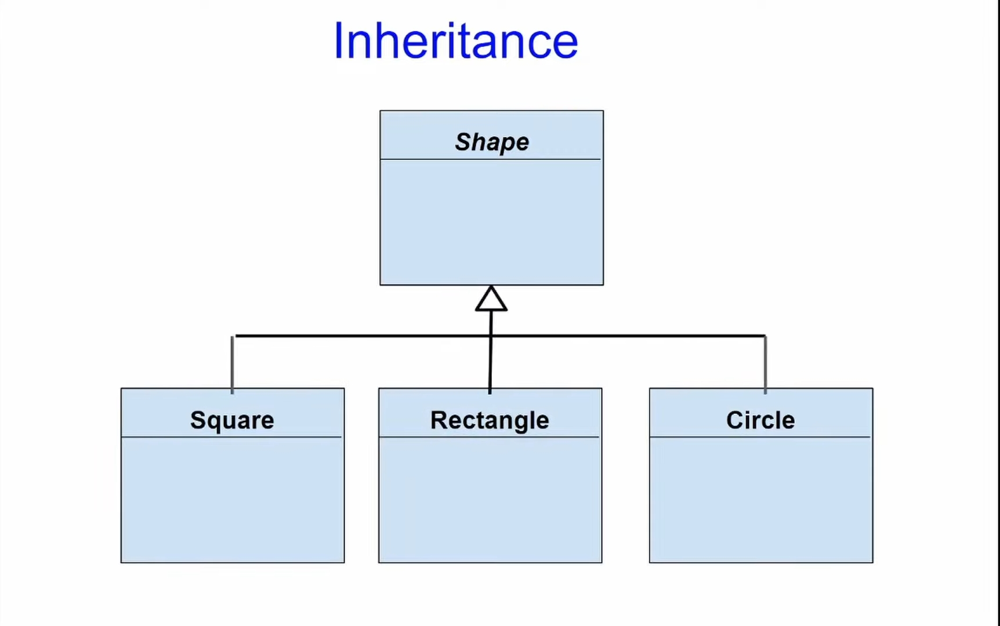

  - Realization
    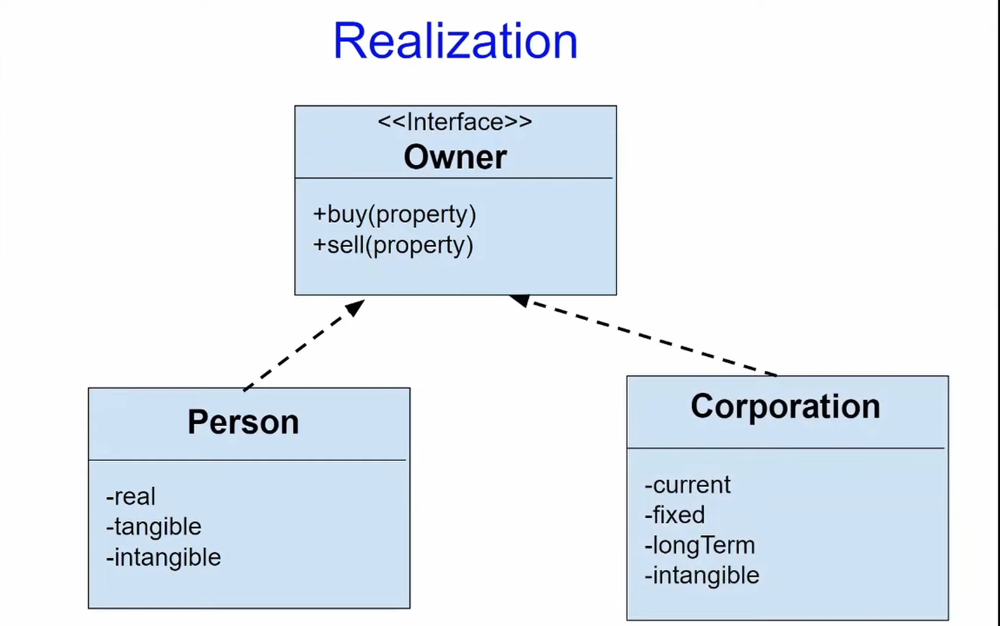
  - Dependecy
    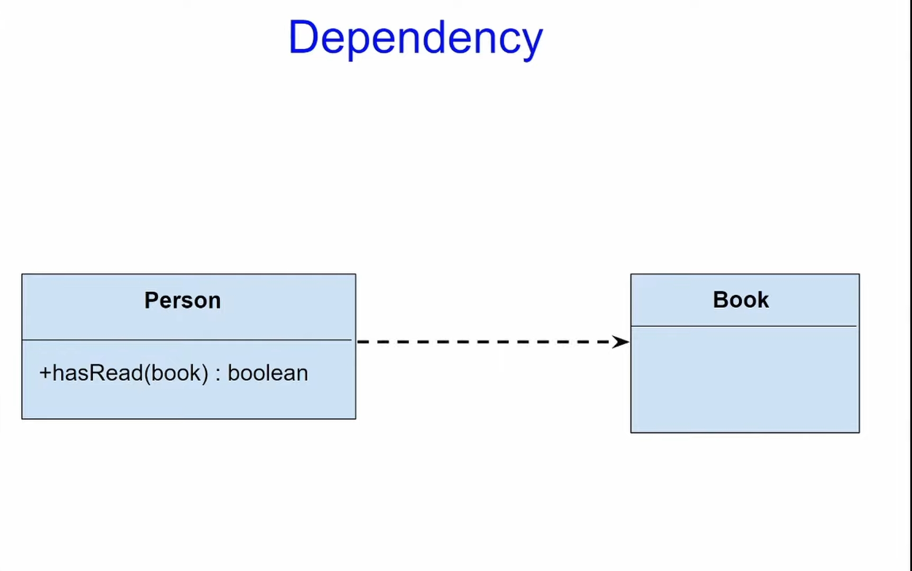
  - Aggregation
    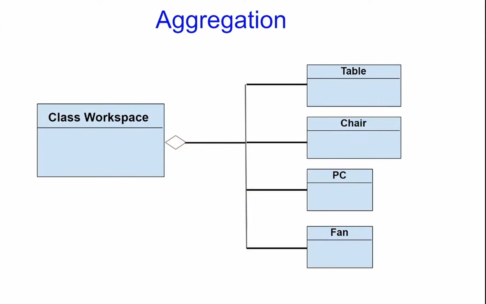
  - Composition

    - Type of aggregation where the component classes are destroyed when the aggregate class is destroyed

    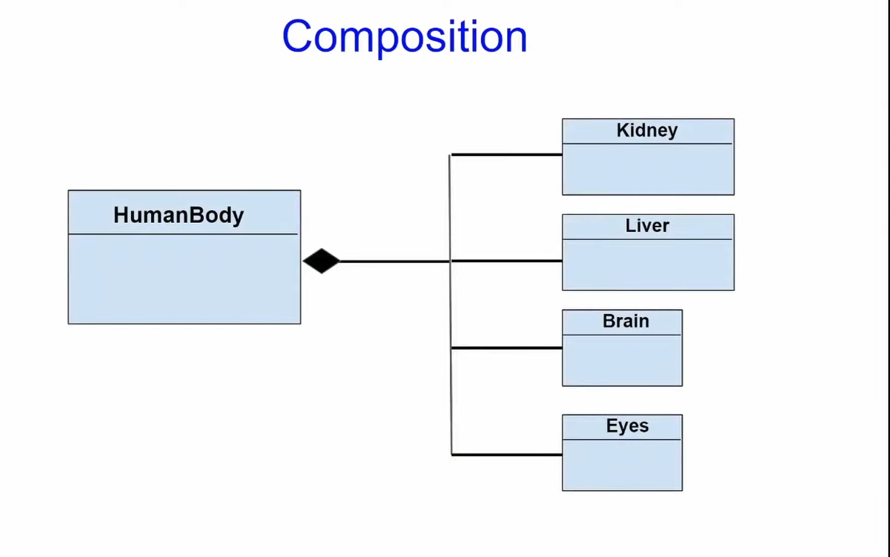

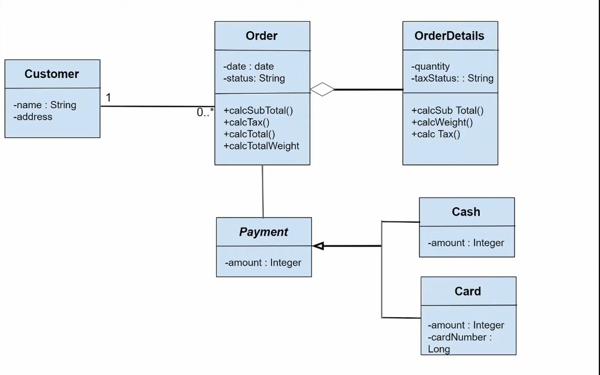

---
